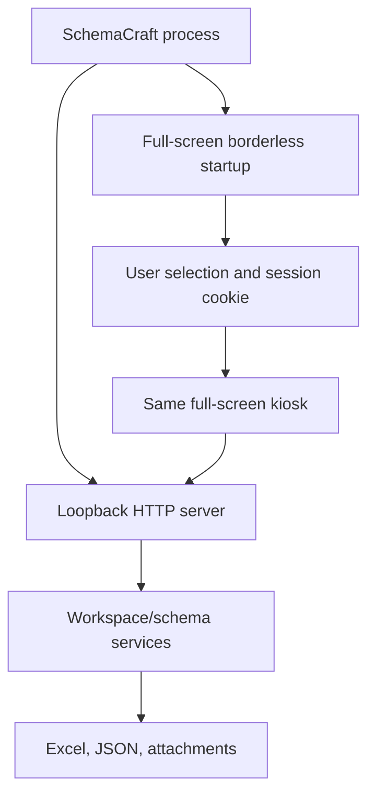

# Architecture

## Runtime topology

SchemaCraft is a local web application packaged as a desktop executable. One
Python process owns the data and starts an HTTP server on a deterministic port
bound to `127.0.0.1`. A Chromium-family browser is opened in application mode.

The full-screen startup surface is available before workspace initialization completes. It polls a
non-sensitive status endpoint using a one-time launch capability carried in
the URL fragment. The capability is never sent in a URL request or written to
the application log. Successful user selection consumes it and creates an
HttpOnly SameSite session cookie.

The launcher uses an isolated Chromium/Edge profile in kiosk mode, so the
Windows title bar and its Close, Minimize, and Maximize/Restore buttons never
appear. Startup, main UI, and closing are page transitions within that one
surface. Shutdown revokes the session, expires its cookie, and terminates the
dedicated browser process tree before the Python process exits.

## First-party layers

| Layer | Primary files | Responsibility |
| --- | --- | --- |
| Process and API | `SchemaCraft.py` | Lifecycle, routing, validation, records, search, exports, server |
| Security | `schemacraft_security.py` | bcrypt, startup capability, browser sessions, throttling |
| Workspace | `schemacraft_workspace.py` | Multiple schemas, paths, context selection, mappings |
| Advanced stores | `schemacraft_advanced.py` | Definitions, histories, audit users, packages, PDFs |
| Excel exchange | `schemacraft_io.py` | Import inspection/parsing and workbook exports |
| Frontend foundation | `app/src/core/` | State, runtime, workspace switching, events |
| Feature pages | `app/src/pages/` | Home, Entry, Search, Builder, Settings, Import/Export |
| Styling | `app/src/styles/application.css` | Canonical application UI |
| Lifecycle UI | `app/src/lifecycle/` | Startup/login and closing windows |

## Generated assets

`build_frontend.py` resolves HTML includes and concatenates JavaScript in
`javascript.manifest` order. The style manifest now contains only the canonical
stylesheet. It also copies lifecycle assets into `app/`.

The source files are authoritative. Generated assets remain in the package so
the executable can start without a frontend build step.

## Concurrency and consistency

- Workbook and schema writes are atomic or use temporary replacements.
- Workspace contexts isolate schema-specific paths in each request thread.
- Dataset snapshots cache coherent workbook/index views and are invalidated
  after mutation.
- Revision and `updated_at` checks reject stale schema or record writes.
- Shutdown waits until requests have remained idle for a bounded grace period.
